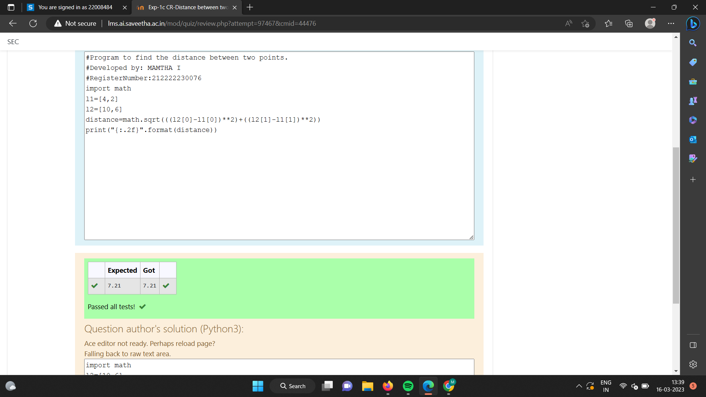

# DISTANCE-BETWEEN-TWO-POINTS

## AIM:
To write a python program to find the distance two 2 points
## ALGORITHM:

### Step 1:

Import numpy module to use built-in functions
### Step 2:

Get lists from the linear equations and assign it to np.array
### Step 3:

Substitute the values in the distance formula  
### Step 4:

Print the result.
### Step 5: 

End the program.

## PROGRAM:

## Program to find the distance between two points.

#Developed by: MAMTHA I

#RegisterNumber:212222230076

import math

l1=[4,2]

l2=[10,6]

distance=math.sqrt(((l2[0]-l1[0])**2)+((l2[1]-l1[1])**2))

print("{:.2f}".format(distance))

## OUTPUT:

## RESULT:
Thus the distance between the two points is successfully obtained
